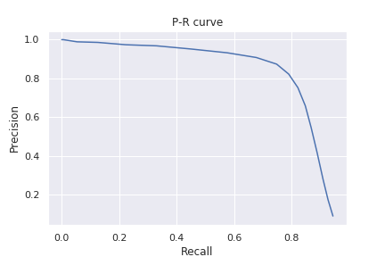

# Detection Result Evaluation
this is a simple code to evaluate the performance of one type object detection algorithm.

## Usage
Input two files: ground truth ('anno.txt') and prediction result ('result.txt').

run: 
``` python3 detection_eval.py ```

We can get the P-R curve and the AP value:


```
[[[ IoU threshold is 0.50 ]]] 
[]Threshold:0.000  Precision:0.091  Recall:0.945 
[]Threshold:0.100  Precision:0.091  Recall:0.945 
[]Threshold:0.200  Precision:0.283  Recall:0.910 
[]Threshold:0.300  Precision:0.547  Recall:0.869 
[]Threshold:0.400  Precision:0.753  Recall:0.823 
[]Threshold:0.500  Precision:0.874  Recall:0.749 
[]Threshold:0.600  Precision:0.932  Recall:0.576 
[]Threshold:0.700  Precision:0.968  Recall:0.330 
[]Threshold:0.800  Precision:0.986  Recall:0.126 
[]Threshold:0.900  Precision:1.000  Recall:0.006 
[AP]:0.83046 
```

## Input Format
The format of input files
(annotation files & detection results file)

### annotation file
annotations file should follow the format like this:

eg. in 'annotation.txt'

``` 
path/to/image_name.jpg x1 y1 x2 y2 x1 y1 x2 y2 ......
path/to/image_name.jpg x1 y1 x2 y2 x1 y1 x2 y2 ......
......
```

or 

``` 
image1.jpg x1 y1 x2 y2
image1.jpg x1 y1 x2 y2
image2.jpg x1 y1 x2 y2
image3.jpg x1 y1 x2 y2
image3.jpg x1 y1 x2 y2
image3.jpg x1 y1 x2 y2
......
```

or see 'anno_example1.txt' or 'anno_example2.txt' in example folder
### detection results file
detection results should follow the format like this:

eg. in 'result.txt'

``` 
path/to/image.jpg    
number_of_detection    
x1 y1 x2 y2 p1    
x1 y1 x2 y2 p2   
....    
....    
Images/01.jpg    
2    
99 102 149 152 0.95    
23 23 55 55 0.55    
```

or see 'example_result_format.txt' in example folder

*the 'path/to/image.jpg' is the index, and it should be the same in 'anno.txt' and 'result.txt' for the same image*

## TODO
- [ ] increase test data by filping the test images and annotations
- [ ] add TTA (test time augmentation)
